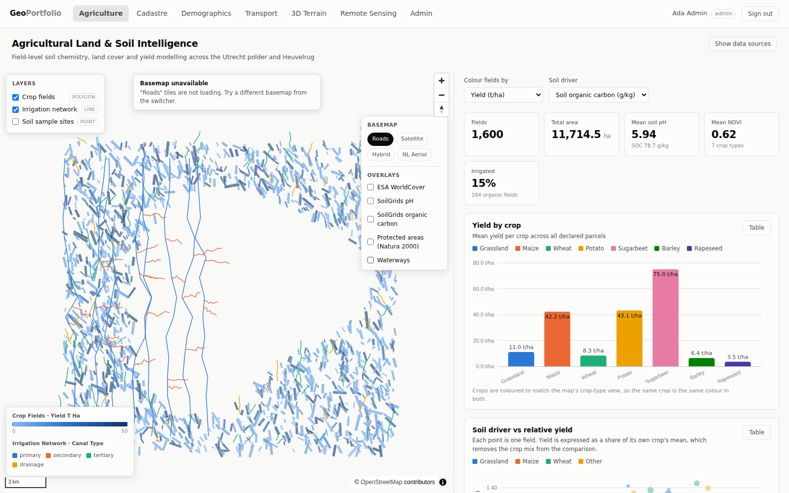

# Geospatial Portfolio — six projects over one study area

Six geospatial analytics projects sharing a single footprint (**Utrecht, Netherlands**), so
every layer overlays exactly:

| Project | What it answers | Polygon layer | Line layer |
|---|---|---|---|
| **Agriculture** | Does soil chemistry actually predict yield? | crop fields | irrigation network |
| **Cadastre** | Where is land value, and where is unused capacity? | parcels, zoning | boundaries & easements |
| **Demographics** | What drives neighbourhood income? Who commutes where? | census tracts, population grid | commute desire lines |
| **Transport** | Where does the network fail, and who can reach what? | accessibility isochrones | roads, transit routes |
| **3D Terrain** | How is the city massed, and what is its solar potential? | buildings (extruded), elevation bands | contours, hydrology |
| **Remote Sensing** | What changed, where is it hottest, and where is the ground sinking? | index grid, change areas, water extent, scene footprints | deformation profiles |

Vector tiles are generated in PostGIS with `ST_AsMVT`, served by FastAPI behind role-based
access control, and rendered with MapLibre. Analytics panels are D3 over aggregate endpoints.



---

## Quickstart

```bash
git clone <this repo> && cd gisprojects
make up        # PostGIS + API + web; the API applies migrations on start
make seed      # generate and load the demo dataset (~45k rows, ~20s)
```

Then open **http://localhost:5173** and sign in with any demo account below
(password `demo1234`). The API docs are at **http://localhost:8000/docs**.

| Account | Role | Sees |
|---|---|---|
| `admin@geo.dev` | admin | Everything, plus user and role administration |
| `analyst@geo.dev` | analyst | All six projects, analytics and export |
| `agronomist@geo.dev` | agronomist | Agriculture read/write — **the cadastre is hidden** |
| `planner@geo.dev` | planner | Cadastre + transport read/write — **agriculture is hidden** |
| `viewer@geo.dev` | viewer | Map layers only: no analytics detail, no export |

Signing in as the agronomist is the quickest way to see the access control working: the
cadastre disappears from the navigation, **and** a direct request for its tiles returns 403.
It is not a hidden link.

### Without Docker

```bash
make install                    # virtualenvs + npm install
createdb gisportfolio           # needs Postgres 14+ with PostGIS 3
make migrate                    # alembic upgrade head
make dev-seed                   # load the demo dataset
make dev-api                    # :8000
make dev-web                    # :5173
```

---

## What is worth looking at

**The tile query** (`backend/app/services/mvt.py`). The tile envelope is transformed into the
*storage* SRID and compared against the untransformed geometry column:

```sql
WHERE t.geom && bounds.query_4326
```

Transforming the geometry column instead — the obvious way to write it — makes the GiST index
unusable and turns every tile into a sequential scan of the table.

**The layer registry** (`backend/app/services/layers.py`). Twenty-three layers are declared in one
place, each with its columns, filters, styling hint and required permission. The tile endpoint,
the capabilities endpoint, the generic feature/histogram/export endpoints and the frontend's
layer panel are all driven from it. Adding a layer is one entry.

**Permission checks never name a role.** The API checks codes like `agriculture:read`, so roles
can be reshaped from the admin screen without touching application code. Permissions travel
inside the access token, so the high-frequency path — tile requests — authorises with no
database round-trip. The trade-off is that a revocation takes effect at the next token refresh,
which is why access tokens are deliberately short-lived.

**Crop-indexed correlation** (`backend/app/api/projects/agriculture.py`). A naive correlation
of soil carbon against yield across all crops returns *r ≈ 0.04* — sugarbeet runs at 80 t/ha and
barley at 7, so the crop mix swamps the soil effect. Dividing each field by its own crop's mean
first gives *r ≈ 0.56*. The API returns both numbers and the chart shows them side by side.

**Colour is computed, not chosen.** The categorical palette was run through a CVD validator in
both light and dark modes (worst adjacent-pair ΔE 9.1 light / 8.4 dark). Consequences are
enforced in code: scatter plots cap at three series because that is the all-pairs limit, map
fills draw from the ordinal sub-range of the sequential ramp so no polygon recedes into the
surface, and every chart ships a legend and a table view so nothing rests on colour alone. See
`frontend/src/styles/theme.ts`.

**Every map switches between roads, satellite, hybrid and Dutch aerial imagery** — deliberately
not Google's tile API. Google Maps Platform tiles need an API key tied to a billing account, and
the unofficial `mt0-mt3.google.com` endpoint some hobby projects use needs no key but is not a
documented product, so Google can rate-limit or block it without notice. Everything registered in
`backend/app/services/basemaps.py` is public, key-free and documented instead: OpenStreetMap,
Esri World Imagery, Esri's imagery+labels hybrid, and PDOK's Dutch national aerial imagery, which
is higher resolution than any global provider over Utrecht specifically. The agriculture project
also layers **ESA WorldCover** (10 m global land cover, 11 classes) over the satellite basemap, as
a live WMS overlay with its official legend — see `frontend/src/components/BasemapSwitcher.tsx`.

**Remote sensing without a raster tile server** (`backend/app/services/remote_sensing.py`'s
sibling, `app/api/projects/remote_sensing.py`). Rasters are zonal-summarised onto a 500 m
vector grid once, at load time — which is what a real workflow produces anyway — so the whole
project rides the same MVT path as every other layer instead of needing a second serving
stack. Three of its results are worth the click:

- **The urban heat island is measured, not asserted.** LST regressed against NDVI returns
  *r ≈ −0.70*, and against impervious cover *r ≈ +0.75*: vegetation cools by
  evapotranspiration, sealed ground stores heat. Built-up land runs ~4.8 °C above the rest of
  the study area.
- **Cloud is the reason the radar layers exist.** Only about 15 % of the optical archive over
  the Netherlands clears a 30 % cloud threshold, and the gap falls in winter. Sentinel-1 is
  unaffected, which is why the water-extent and ground-motion layers are SAR-derived.
- **Peat sinks; sand does not.** InSAR velocities come out at −8.5 mm/yr over the drained
  western polder against −0.4 mm/yr on the Heuvelrug ridge. The deformation profiles rank
  corridors by *differential* settlement rather than rate, because a structure sinking
  uniformly is far less of a problem than one sinking unevenly.

---

## Layout

```
backend/          FastAPI: auth, RBAC, MVT tiles, per-project analytics
  alembic/        migration chain -- the single source of truth for the schema
  app/models/     declarative models (auth + spatial), the autogenerate target
  app/services/   layer registry, MVT builder, generic feature/aggregate queries
  tests/          110 integration tests against live PostGIS
etl/              open-data registry, downloaders, synthetic generator, loader
frontend/         React + MapLibre + D3
docs/             data sources, architecture, RBAC, deployment
scripts/          dev server helper, end-to-end screenshot smoke test
```

---

## Data

The schema mirrors real open datasets — BRP crop parcels (CC0), Kadaster BRK, CBS
neighbourhood statistics, OSM via Geofabrik, 3DBAG, Copernicus DEM, ESA WorldCover, ISRIC
SoilGrids, Sentinel-1/2, Landsat Collection 2 and the Copernicus Ground Motion Service. Every
URL, licence and load command is in **[docs/DATA_SOURCES.md](docs/DATA_SOURCES.md)**,
and each project surfaces its own provenance in a "data sources" panel generated from the same
registry.

**The running instance loads a synthetic stand-in, not those files.** The real extracts total
~660 MB and need GDAL, an OSM PBF reader and network access; `etl/generate.py` writes the same
schema with the same attribute distributions in about twenty seconds with no network, so the
whole stack is demonstrable immediately. It is seeded, so two runs produce identical output.

The synthetic data is shaped to the real region rather than being random: relief climbs from
below-NAP polder in the west onto the Utrechtse Heuvelrug in the east, soil texture follows that
same west-to-east gradient (peat → river clay → glacial sand), the crop mix is
grassland-dominated as Utrecht's is, the modal split has bike at ~35%, and the housing series
shows the 2021–22 run-up and the 2023 correction. That is what makes the charts show the
patterns a reviewer expects instead of noise.

To load the real data instead, point `etl/download.py` at the registry in `etl/config.py`.

---

## Migrations

Alembic owns the schema. There are no init SQL scripts.

```bash
make migrate            # upgrade head
make migrate-check      # fail if the models have drifted from the migrations
make migration m="add solar column"
make migrate-history
make migrate-sql        # print the whole chain without running it
```

The chain is nine revisions: extensions and schemas, RBAC tables, one revision per project, and
the permission catalogue as a data migration. Every revision has a real downgrade, and
`upgrade → downgrade → upgrade` round-trips cleanly. `tests/test_migration_files.py` asserts the
history stays linear and that no revision ships an empty downgrade.

---

## Tests

```bash
make test        # in Docker
make dev-test    # locally
```

76 integration tests against a live PostGIS — the interesting logic is SQL, and a mocked session
would verify none of it. They cover the auth flows (including that login cannot be used to
enumerate accounts, and that a replayed refresh token fails), the full RBAC matrix, MVT tiles
decoded back into features, filter pushdown, SQL-injection rejection, every analytics endpoint,
and the migrated schema itself (every geometry column indexed, every layer in the registry
matching a real table).

The end-to-end check drives a real browser:

```bash
./scripts/devserver.sh start
cd frontend && VITE_API_TARGET=http://127.0.0.1:8099 npm run dev &
npm run screenshots
```

It signs in, visits every project, captures screenshots and exits non-zero on any application
error — separating those from third-party basemap/DEM failures, which the app is built to
survive. It found four real bugs that were invisible from the test suite: a MapLibre expression
that silently dropped a layer, duplicate React keys, a `mode` column meaning different things on
different layers, and an unreachable DEM blanking the entire map.

---

## Deployment

Built to run on free tiers: **[docs/DEPLOYMENT.md](docs/DEPLOYMENT.md)** covers which managed
Postgres providers actually support PostGIS without a card, which "free" tiers quietly expire,
and how to split static tiles from the API so a recruiter never waits on a cold start.

## Further reading

- **[docs/ARCHITECTURE.md](docs/ARCHITECTURE.md)** — how a tile request flows, and why each layer is where it is
- **[docs/RBAC.md](docs/RBAC.md)** — the permission model and how to extend it
- **[docs/DATA_SOURCES.md](docs/DATA_SOURCES.md)** — every dataset, licence and download command
- **[docs/DEPLOYMENT.md](docs/DEPLOYMENT.md)** — free-tier hosting, with the traps

## Attribution

Open data used or modelled, per `docs/DATA_SOURCES.md`: OpenStreetMap contributors (ODbL);
Kadaster BAG/BRK and RVO BRP via PDOK; CBS Wijk- en Buurtkaart (CC BY 4.0); 3DBAG © tudelft3d
and 3DGI (CC BY 4.0); ESA WorldCover (CC BY 4.0); ISRIC SoilGrids (CC BY 4.0); Copernicus DEM
© ESA / European Union; terrain tiles by Mapzen / AWS Open Data.
